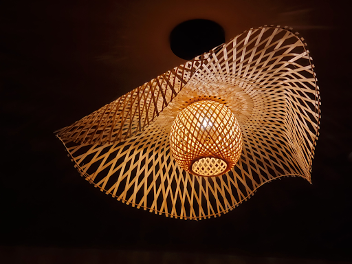

# Introduction to Generative Art and Scientific Visualization (January@GSAS 2023)

## Friday schedule

|   Time (ET)   |           Topic           | Instructor | Notebook | Software| Asset |
|:-------------:|:-------------------------:|:----------:|:--------:|:-------:|:-----:|
|  10:00-10:10  |           Recap           |            |          |         |       |
|  10:10-10:40  |       3D printing I       |   Jiayin   | [01_3d_printing.ipynb](https://github.com/yue-sun/generative-art/blob/main/05_friday/01_3d_printing.ipynb) [lamp_pieces_model.nb](https://github.com/yue-sun/generative-art/blob/main/05_friday/assets/lamp_pieces_model.nb) | [Install 3D printing software](https://github.com/yue-sun/generative-art/tree/main/05_friday#3d-printing-software-download-and-preparation-instructions) | [LampBottom.stl](https://github.com/yue-sun/generative-art/blob/main/05_friday/assets/LampBottom.stl) [LampBottomFull.stl](https://github.com/yue-sun/generative-art/blob/main/05_friday/assets/LampBottomFull.stl) [LampTop.stl](https://github.com/yue-sun/generative-art/blob/main/05_friday/assets/LampTop.stl) [LampTopFull.stl](https://github.com/yue-sun/generative-art/blob/main/05_friday/assets/LampTopFull.stl) [rabbit_image.jpg](https://github.com/yue-sun/generative-art/blob/main/05_friday/assets/rabbit_image.jpg)
|  10:40-11:10  |       3D printing II      |   Jiayin   |          |         |       |
| _11:10-11:20_ | _Break/in-class activity_ |    _--_    |   _--_   |  _--_   |  _--_ |
|  11:20-11:50  |      3D printing III      |   Jiayin   |          |         |       |
|  11:50-12:20  |    GAN art and DALL·E 2   |  Nina, Yue | [02_gan_art.ipynb](https://github.com/yue-sun/generative-art/blob/main/05_friday/02_gan_art.ipynb) |         |       |
|  12:20-12:30  |         Conclusion        |   Jovana   |          |         |       |

## Day 5: More tools and neural networks

### Part 1: 3D printing (Jiayin)
We will make a 3D model of a lamp, which you can print out after! It is inspired by a lamp I saw at Life Alive Organic Cafe at Harvard Square:

Instead of a hanging lamp, we will create a standing lamp. We will use Mathematica to create the bottom and top pieces. And then we will use Blender to do post-processing. 

We will also learn to create some 3D models by using 2D designs.

We will finish our printable models in class, and you may print them out yourself later. 

### Part 2: Generative art with neural networks (Nina and Yue)
While traditional generative algorithms use predefined rules to create patterns and images, generative neural networks learn these rules based on data, often enabling much more diverse and complex designs. In this session, we will create new generative art by implementing one popular generative model - the Generative Adversarial Network (GAN). We will also explore other neural network approaches, like neural style transfer to apply visual styles to other images, and the now-trending DALL-E 2 to generate images based on texts.

## Recommended readings/videos:
- More on GANs and Pokémon:
    - [Generating art using GANs](https://blog.jovian.ai/generating-art-with-gans-352ceef3d51f)
    - [Monster GANs](https://medium.com/@yvanscher/using-gans-to-create-monsters-for-your-game-c1a3ece2f0a0)
    - [PokeGAN](https://towardsdatascience.com/i-generated-thousands-of-new-pokemon-using-ai-f8f09dc6477e)
- “Must-read” on neural style transfer:
    - The seminal paper ([Gatys et al. 2016](https://openaccess.thecvf.com/content_cvpr_2016/html/Gatys_Image_Style_Transfer_CVPR_2016_paper.html))
    - Interesting applications in fluid animation ([1](https://dl.acm.org/doi/10.1145/3355089.3356560), [2](https://www.youtube.com/watch?v=TyNlaBoP6oI), [3](https://cgl.ethz.ch/publications/papers/paperKim20a.php))
    - TensorFlow implementation ([code](https://www.tensorflow.org/tutorials/generative/style_transfer))
- More on DALL-E 2:
    - Official [website](https://openai.com/dall-e-2/) and [THE paper](https://arxiv.org/pdf/2204.06125.pdf)
    - Discussions on copyright issues ([1](https://www.technollama.co.uk/dall%C2%B7e-goes-commercial-but-what-about-copyright), [2](https://www.wired.com/story/openai-dalle-copyright-intellectual-property-art/), [3](https://kotaku.com/ai-art-dall-e-midjourney-stable-diffusion-copyright-1849388060))

## 3D printing software download and preparation instructions

### ***:heavy_exclamation_mark::heavy_exclamation_mark::heavy_exclamation_mark:Please make sure to complete the following before class, as the downloads take a long time. So we can save time in class to make models :):heavy_exclamation_mark::heavy_exclamation_mark::heavy_exclamation_mark:***

- Mathematica (Free for Harvard affiliates): For Harvard affiliates, please download and create your Mathematica account for free using your Harvard email: https://downloads.fas.harvard.edu/download (Scroll down to "Mathematica and Wolfram|Alpha Pro"; Input your Harvard email; Then select "Wolfram Mathematica" Download to your lap top locally; afterwards, please make sure it works as expected, i.e. you are able to create a notebook and use it.)

- Inkscape (Free): Please download the latest version of Inkscape here: https://inkscape.org/release/inkscape-1.2.2/

- Blender (Free): Please download the latest version of Blender here: https://www.blender.org/download/

- MeshLab (Free): Please download the latest version of MeshLab here: https://www.meshlab.net/#download
