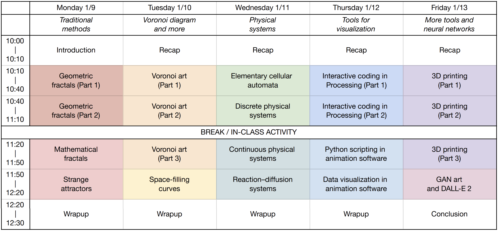

# Introduction to Generative Art and Scientific Visualization (January@GSAS 2023)

## **To enroll: Please fill out [the Google Form](https://docs.google.com/forms/d/e/1FAIpQLScz5_jmoouKRGaHxp-3YwT_7SfrEJYPgFAIoVfT7sPREAXWTQ/viewform) by January 8, 2023**

- No enrollment cap
- Class open to the public; all are welcome to enroll!
- You can sign up for as many or as few days as you want
- To preview some of the topics we will be covering, you can visit previous iterations of the [Generative Art Workshop](https://github.com/gvarnavi/generative-art-iap) taught during MIT IAP 2017-2022

## Schedule

Hybrid location: Maxwell Dworkin 221 (in-person) and [via Zoom](https://harvard.zoom.us/j/98070950257?pwd=K2F0cDBUM0IxZkplbFBRWG01N1BEdz09) (virtual)

Class times: 1/9-1/13/2023, 10am-12:30pm



## Syllabus and code examples

- **[Courese introduction and logistics (slides)](https://github.com/yue-sun/generative-art/blob/main/01_monday/00_intro_logistics.pdf)**
- [Monday (1/9)](https://github.com/yue-sun/generative-art/tree/main/01_monday/README.md): Fractals, strange attractors
- [Tuesday (1/10)](https://github.com/yue-sun/generative-art/tree/main/02_tuesday/README.md): Voronoi art, space-filling curves
- [Wednesday (1/11)](https://github.com/yue-sun/generative-art/tree/main/03_wednesday/README.md): Elementary cellular automata, pattern formation in physical systems
- [Thursday (1/12)](https://github.com/yue-sun/generative-art/tree/main/04_thursday/README.md): Interactive coding with Processing, Python scripting in animation software
- [Friday (1/13)](https://github.com/yue-sun/generative-art/tree/main/05_friday/README.md): 3D printing, generative art with neural networks

## Course description

Generative art encapsulates the balance between art and science. Through mathematical equations and physical systems, we can algorithmically generate mesmerizing visual patterns for pure aesthetics or scientific visualization. This five-day mini-course explores representative aspects of generative art and data visualization through in-class code examples. We will begin with traditional generative methods like fractals and chaotic attractors, then focus on pattern formation with the Voronoi diagram and physical systems, and finally survey some modern neural-network-inspired approaches. In addition, we will briefly introduce tools for rendering 3D scientific data in animation software, interactive coding, and 3D printing of your generated art.

>(This mini-course is modeled from—and the sixth iteration of—the generative art workshop, taught over MIT IAP from 2017 to 2022 by Drs. Emma Vargo, George Varnavides, Amina Matt, Jovana Andrejević and Nina Andrejević. We are grateful to all the previous MIT instructors for some original content to be used in the mini-course.)

## Course instructors
Yue Sun, Jiayin Lu, Jovana Andrejević, and Nina Andrejević
>(A short instructors bio is on the [Engage page](https://engage.gsas.harvard.edu/event/8632768).)

## What you will gain from this mini-course?

- Be familiar with examples of generative art and their mathematical/physical formulation
- Learn to code functions and recursive algorithms to procedurally generate/animate art
- Use Python libraries and animation/modeling software to visualize 2D/3D scientific data
- **Have fun generating art!**

## Programming language

While there are many great programming and scripting languages to do generative art with, the class will be taught using Python. This choice is partly due to the following reasons (aside from the instructors' familiarity):
1. Ease of prototyping (and learning) code
2. Built-in (high-level) visualization functions
3. The interactive Notebook format compliments the way we prototype and think of generative art

### Python installation instructions

We'll be using [Google's Colaboratory](https://colab.research.google.com/notebooks/welcome.ipynb) to run Jupyter notebooks in Python. Google Colab is a cloud-based, free Jupyter notebook environment, and the notebooks can be downloaded if you prefer to run with a local Jupyter installation. All you need to use Google Colab is a Google account.

>If you want to run the code examples locally, you need to install Python and Jupyter notebook environment locally. See [this installation instruction](https://github.com/sarah1123/SciComp-F22-AM111/tree/main/00_python_tutorial#python-installation) for more details. [Visual Studio Code](https://code.visualstudio.com/) is a popular choice to edit Jupyter notebooks locally. See [this page](https://github.com/sarah1123/SciComp-F22-AM111/tree/main/00_python_tutorial#recommended-python-editor) for more installation details.

### Run code (directly online)

Click "Open in Colab" badge on the top of each `.ipynb` notebook to run (no need to install anything for Python to run).

> If you are running the notebook on Google Colab, please make a copy of the notebook to your drive:
>
> - Click "Copy to Drive"
> - Or navigate to "File -> Save a copy in Drive"
> - Or navigate to "File -> Download" and save a local copy

Or else your changes in the playground mode will get lost after you close the page.

### Run code (locally)

We store all code examples on GitHub, which allows us to version control the code. To have your own local updated copy of the course git repo:
1. Open your terminal and navigate to target directory
    ```
    cd your_target_directory_generative_art
    ```

2. Clone the Git repo
    ```
    git clone https://github.com/yue-sun/generative-art.git
    ```

3. To access updates to the code examples use
    ```
    git pull
    ```
You can also use the GitHub Desktop app to keep a local copy of the repo. If you use VS Code, its source control should automatically have the options to pull the changes.

## **WORK-IN-PROGRESS: Software download instructions**

Please check back later for our recommended software to install for 3D printing and animation.